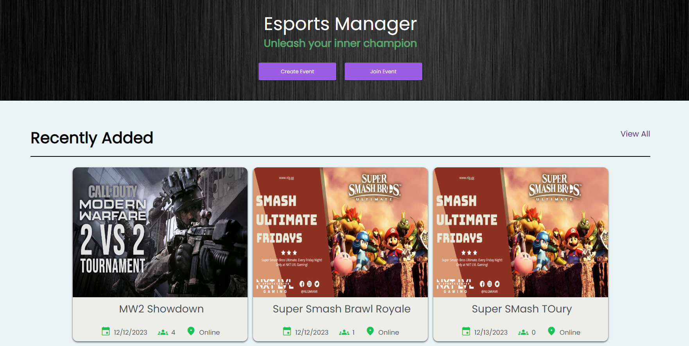

# E-Sports Manager

## Introduction
E-Sports Manager is a comprehensive platform designed for E-sports enthusiasts and event organizers. Built with the MERN stack (MongoDB, Express.js, React.js, and Node.js), this application provides a robust and user-friendly interface for managing and participating in E-sports events. It incorporates Bcrypt for secure password handling and JSON Web Tokens (JWT) for user authentication, ensuring a secure user experience.

## Features
E-Sports Manager offers a variety of features to cater to the needs of the E-sports community:

- **User Account Creation:** Users can sign up to create their unique profiles.
- **Account Personalization:** Users can personalize their profiles with various customization options.
- **Event Creation:** Users can create their own E-sports events, specifying details like game, format, and schedule.
- **Join Events:** Users can browse and join events created by others.
- **Event Brackets:** The platform offers real-time tracking of event brackets and match progress.
- **Games Database:** A comprehensive list of games available for event creation.

## Technologies Used
- **MongoDB:** A NoSQL database for storing user and event data.
- **Express.js:** A web application framework for Node.js.
- **React.js:** A JavaScript library for building user interfaces.
- **Node.js:** A JavaScript runtime for building scalable network applications.
- **Bcrypt:** For hashing and securing user passwords.
- **JSON Web Tokens (JWT):** For secure user authentication and session management.

## Installation

To get started with E-Sports Manager, follow these steps:
1. Clone the repository:
```bash
git clone https://github.com/dvvin/E-Sports-Manager.git
```
2. Install dependencies:
```bash
npm install
```
3. Start the server:
```bash
npm run server && npm run start
OR
npm run conc
```
4. Open the browser and navigate to http://localhost:3000

## Homepage Example:

